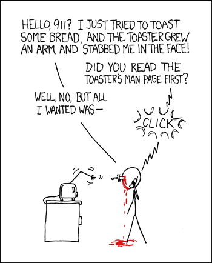

In web development, designing an efficient and visually appealing user interface is crucial. While it is possible to achieve this using raw HTML and CSS, UI frameworks like Bootstrap 5 provide a more streamlined and structured approach. These frameworks not only enhance development speed but also improve maintainability and consistency across projects.

## The Advantages of Using UI Frameworks

One of the main benefits of UI frameworks is faster development. Bootstrap 5 offers pre-defined styles, grid systems, and components like buttons and navigation bars. Developers can quickly build complex layouts without writing large amounts of CSS from scratch, reducing redundancy and making development more efficient.

Another major advantage is the built-in responsive design. With many devices accessing web applications, ensuring a proper display across different screen sizes is essential. Bootstrap 5 uses a flexible grid system and flexbox layouts, allowing developers to create fluid designs without manually handling media queries.

Additionally, UI frameworks include various ready-made components, not just basic styling tools. Bootstrap 5 provides modals, carousels, and dropdown menus that follow accessibility standards, improving the user experience. These pre-built components save development time by reducing the need to implement UI elements from scratch.

## Why Not Just Use Raw HTML and CSS?

While HTML and CSS allow full control over styling, using them alone has some drawbacks. Handcrafting every UI component takes a lot of time, especially in large projects, making it an inefficient approach.

Cross-browser compatibility is another issue. Ensuring a consistent look and functionality across different browsers can be challenging, but UI frameworks include built-in optimizations to handle these problems.

Consistency and maintainability are also concerns. In projects with multiple developers, without a unified framework, different developers may use different styling approaches, leading to a messy and hard-to-maintain codebase. Bootstrap’s predefined class names, like btn-primary and text-muted, improve readability and prevent inconsistent styles. UI frameworks enforce structure and best practices, making collaboration easier.

Given these challenges, relying only on raw HTML and CSS is often impractical, especially in fast-paced development environments where efficiency is key.
## A Hybrid Approach: Combining UI Frameworks with Custom Components

In real-world development, it is not always necessary to depend entirely on a UI framework. A common practice is to combine UI frameworks with custom-built components to achieve greater flexibility and maintainability.

For example, in my own experience, I use lucide-react as the icon library while leveraging Bootstrap 5 for positioning, font color, and sizing. However, for more complex UI components, custom-built solutions are preferred over framework-provided components to ensure better customization and control.

A practical example of this approach is the DynamicModal component in the project I was working on, which is a reusable modal dialog implemented using React and custom UI components instead of Bootstrap. By creating custom components, developers can ensure that the design aligns more closely with the unique branding and style of a specific website or application. Unlike generic framework components, custom-built UI elements allow for deeper customization, improved user experience, and a more cohesive visual identity.
```
'use client';

import {
    AlertDialog,
    AlertDialogHeader,
    AlertDialogContent,
    AlertDialogDescription,
    AlertDialogTitle,
    AlertDialogFooter,
    AlertDialogCancel
} from '@/components/ui/alert-dialog';
import { ReactNode } from 'react';
import { Button } from '@/components/ui/button';

const DynamicModal = ({
                          open,
                          title,
                          body,
                          warning,
                          buttons,
                          cancelText = "Cancel",
                          onClose
                      }: {
    open: boolean;
    title: string;
    body: string;
    warning?: string;
    buttons?:  ReactNode[];
    cancelText?: string;
    onClose: () => void;
}) => {
    return (
        <AlertDialog open={open}>
            <AlertDialogContent>
                <AlertDialogHeader>
                    <AlertDialogTitle>{title}</AlertDialogTitle>
                    <AlertDialogDescription>{body}</AlertDialogDescription>
                    {warning && (
                        <AlertDialogDescription>
                            <div className="bg-yellow-100 border border-yellow-200 p-3 rounded-md ml-2.5">
                                {warning}
                            </div>
                        </AlertDialogDescription>
                    )}
                </AlertDialogHeader>
                <AlertDialogFooter>
                    {buttons?.map((button, index) => (
                        <Button key={index} onClick={onClose}>
                            {button}
                        </Button>
                    ))}
                    <AlertDialogCancel onClick={onClose}>{cancelText}</AlertDialogCancel>
                </AlertDialogFooter>
            </AlertDialogContent>
        </AlertDialog>
    );
};

export default DynamicModal;

The DynamicModal component is a flexible modal dialog built using the ShadCN UI library instead of Bootstrap’s default modal implementation. It provides a structured way to handle modals while allowing developers to pass dynamic content, warnings, and custom buttons.

This component receives multiple props, including open to control its visibility, title, and body for content, warning for optional alert messages, and buttons for additional custom actions. The cancelText prop allows customization of the cancel button’s label, while the onClose function handles closing the modal.

The UI structure consists of an AlertDialog element that encapsulates the content and header. If a warning message is provided, it is displayed inside a yellow alert box. The footer section dynamically renders any buttons passed to the component while ensuring a cancel button is always available.

The Modals shown in the picture are all derived from this code. We use different props to make the Modal display different styles.
```
## Why Choose Custom Components Over Bootstrap for Modals?
Although Bootstrap provides a built-in modal component, using a custom implementation like DynamicModal has several advantages. Custom components allow for greater control over styling and behavior, ensuring they align with the project’s design guidelines. They also integrate seamlessly with utility-based styling frameworks such as Tailwind CSS, which offers a more flexible approach compared to Bootstrap’s predefined styles.

Additionally, using a component library like ShadCN ensures accessibility and responsiveness while maintaining a clean and modular code structure. This approach is especially beneficial in enterprise-level applications where maintaining consistency across UI elements is a priority.
## Conclusion: Balancing Efficiency and Customization

Bootstrap 5 and other UI frameworks significantly enhance web development efficiency by providing ready-made styles, components, and responsive design capabilities. However, in professional development environments, a balance between framework usage and custom-built components is often the best approach. By selectively using UI frameworks for fundamental styling and layout while implementing custom components for complex UI elements, developers can achieve both efficiency and flexibility.

Ultimately, understanding when to use a UI framework and when to build custom solutions ensures that web applications remain scalable, maintainable, and aligned with modern design standards.

This essay was written with assistance from ChatGPT, which was used to refine wording, improve clarity, and structure the content.

