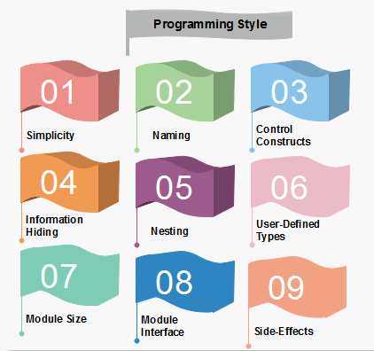

## Introduction: Beyond the Surface of Coding Standards

Many people think of coding standards as just small details—like how much to indent, or whether to put a curly brace on a new line. But they are much more than that. Coding standards play a big role in making code clear, easy to maintain, and simple to work on with others. In this essay, I’ll talk about how coding standards help improve readability, why they’re important in real-life projects, and how they show up in things like pull request reviews. Coding standards aren’t just rules—they make it easier for everyone to work together and keep the codebase in good shape.

## The Role of Coding Standards in Code Readability

Readable code is maintainable code, and coding standards are essential for achieving this. When code lacks consistent formatting, it can create confusion and lead to errors, making it harder for team members or future developers to understand or modify. One of the most important aspects of formatting is indentation, which defines the structure of code blocks. This is especially critical in languages like ML and OCaml, which do not use braces or other explicit markers to indicate code blocks. In such cases, indentation is the only way to show relationships between statements. Poor indentation can create significant misunderstandings. For example, consider the following pseudo-code:

```
if condition
    do something
    do something else
end
```
In this example, proper indentation clearly shows that both do something and do something else belong to the if block. However, if the indentation is incorrect, such as misaligning do something else, it may appear to be outside the if block:

```
if condition
    do something
do something else
end
```
## Coding Standards as a Team’s Signature

Consistency in coding style is crucial for maintaining a clean and understandable codebase, especially when working in a team. Every organization often defines its own coding standards, reflecting its engineering culture. These standards go beyond simple formatting and include aspects such as naming conventions, method structures, and documentation styles. Let’s examine the following example of Java code:

```
@GetMapping(value = "/owners/groupings")
public ResponseEntity<String> ownerGroupings() {
    logger.info("Entered REST ownerGroupings...");
    String currentUid = policy.sanitize(userContextService.getCurrentUid());
    String uri = String.format(API_2_1_BASE + "/owners/%s/groupings", currentUid);
    return httpRequestService.makeApiRequest(currentUid, uri, HttpMethod.GET);
}

/**
 * Request the number of grouping paths owned by principal.
 */
@GetMapping(value = "/owners/groupings/count")
public ResponseEntity<String> getNumberOfGroupings() {
    logger.info("Entered REST getNumberOfGroupings...");
    String currentUid = policy.sanitize(userContextService.getCurrentUid());
    String uri = String.format(API_2_1_BASE + "/owners/%s/groupings/count", currentUid);
    return httpRequestService.makeApiRequest(currentUid, uri, HttpMethod.GET);
}
```
There are several key observations in this example:

    Commenting Style: Each method is preceded by a clear and concise comment explaining its purpose. These comments provide helpful context for teammates, allowing them to understand the functionality without diving into the implementation details.
    Consistent Structure: Both methods follow a standardized pattern:
        Logging is consistently placed as the first statement, ensuring traceability.
        Variables like currentUid and uri are descriptively named, making it immediately clear what they represent.
        The format for API calls is uniform, improving readability and predictability.

Why does this consistency matter? When everyone adheres to the same coding standards, engineers can quickly comprehend code written by others without needing additional explanations. It reduces the cognitive load required to navigate large codebases and makes the codebase feel cohesive, even when multiple contributors are involved. On the other hand, if every team member followed their own preferences, the codebase would quickly become chaotic, leading to misunderstandings, inefficiencies, and wasted time. Consistent coding practices not only streamline collaboration but also reflect a team’s professionalism and commitment to high-quality engineering.
 
## Coding Standards in Practice: The Pull Request Workflow
Code Reviews and PR Merges
Pull requests (PRs) are a crucial part of modern software development, especially on platforms like GitHub. One of the first things reviewers look at when evaluating a PR is whether the code adheres to established coding standards. Following these standards ensures that the codebase remains clean, consistent, and easy to integrate. A well-structured and readable codebase not only reflects professionalism but also simplifies collaboration within the team. For example, my current team enforces strict rules for import statements to maintain clarity and avoid potential issues.
Correct usage of imports looks like this:
```
import java.util.List;
import java.util.ArrayList;
```
Incorrect usage, such as the following, is discouraged:
```
import java.util.*;
```
Why Avoid import *?
There are two main reasons to avoid wildcard imports:

    Code Size: Using import * can pull in unnecessary classes or methods that are not used in the code. This can bloat the compiled program, increasing memory usage and load times, which can be especially problematic in large-scale applications.

    Ambiguity: Importing entire packages can lead to naming conflicts. For instance, if both java.util.* and java.sql.* are imported, and both packages include a Date class, the compiler may struggle to resolve which one to use. This can result in bugs that are hard to track down, particularly when the error isn’t immediately obvious.

Ignoring such standards during code reviews can lead to subtle but significant problems. For example, ambiguous imports might introduce naming conflicts that only surface in specific environments or when new dependencies are added. Similarly, unnecessarily large code imports can impact performance over time. By enforcing coding standards like clear, explicit imports, teams ensure that every line of code has a clear purpose and avoids potential conflicts. This discipline prevents technical issues and fosters trust and reliability within the development process. A clean, standard-compliant PR is easier to review, more likely to be merged quickly, and less likely to introduce regressions or other complications in the future.

## Conclusion

Coding standards are not just guidelines; they are the backbone of producing clean, cohesive, and maintainable software. These standards ensure that code is easy to read, consistent across the team, and clear in its intent, which helps to minimize confusion and reduce errors. Whether it's maintaining proper indentation in languages like ML or Python, where structure directly impacts functionality, or avoiding ambiguous imports in Java to prevent naming conflicts, coding standards reflect a team’s commitment to delivering high-quality work. From my own experience, following coding standards does more than just improve the technical quality of the code—it fosters better collaboration, trust, and efficiency within a team. Consistency in the way we write and review code allows us to focus on solving problems rather than untangling someone else’s logic. As software engineers, adhering to these principles is not only a good practice but also a responsibility to the team and the project. By embracing coding standards, we build a stronger foundation for success, both individually and collectively.

This essay was written with assistance from ChatGPT, which was used to refine wording, improve clarity, and structure the content.....
