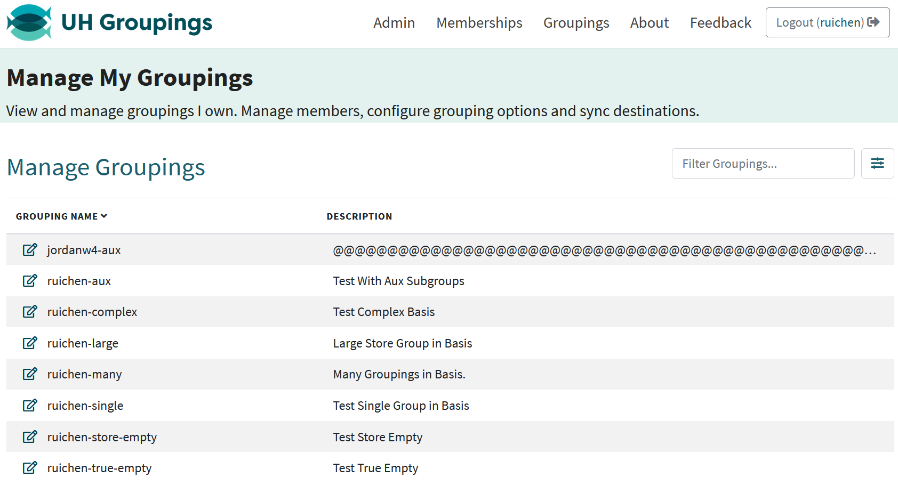

<div class="text-center p-4">
  
</div>

## My Contribution: Club Creation and Viewing

I implemented the **Create Club** feature, including the form modal and routing logic. This feature can be accessed via the **Explore Clubs** page. When a user clicks the image button in the top-right corner, a modal appears prompting them to enter:

- **Creator name**
- **Gmail**
- **Club name**
- **Description**
- **Image URL**

Here is the code used to render the modal form:

```
<Form onSubmit={handleSubmit(onSubmit)}>
  <Form.Group className="mb-2">
    <Form.Label>Creator Name</Form.Label>
    <Form.Control {...register('creator')} required />
  </Form.Group>
  ...
</Form>

```
Once the form is submitted, data is passed to this server function:
```
export async function makeClub(club: {
  name: string;
  description: string;
  creator: string;
  email: string;
  image: string;
}) {
  await prisma.club.create({ data: { ...club } });
}
```

##  Routing and Query Transfer

After a new club is created is displayed on the screen as a `ClubCard`. Each card includes the club's image, name, description, and creator info. Users who click on the card are taken to the **ClubProfilePage**, and important club data is passed along using **query parameters**.

### What are query parameters and why use them?

Query parameters are key-value pairs added to the end of a URL. Next.js allows us to **pass data between pages** without using a global state or database. This makes the website faster and more efficient for small data transfers, like showing club info on different pages.

For example, when a user clicks on a club card, we use the `Link` component from Next.js to go to `/clubs/profile` and include the club’s data as query parameters:

```
<Link
  href={{
    pathname: '/clubs/profile',
    query: {
      name: club.name,
      description: club.description,
      image: club.image,
      creator: club.creator,
      email: club.email,
    },
  }}
>
  <Card.Img src={club.image} />
</Link>
```
This creates a URL like:
```
/clubs/profile?name=Chess%20Club&description=Play%20chess&image=chess.png&creator=Alex&email=alex@gmail.com
```

### How do we read the query parameters?
On the ClubProfilePage, we use the useSearchParams() hook from Next.js to read the data:
```
const searchParams = useSearchParams();
const name = searchParams.get('name') || 'Unnamed Club';
const image = searchParams.get('image') || 'default.png';
```

This allows us to use the data passed from the card to display:
  - ** The club name
  - ** The image
  - ** The description
  - ** The creator's name
  - ** The contact email
