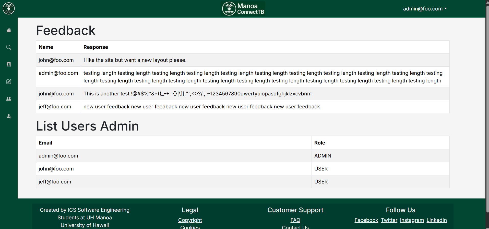
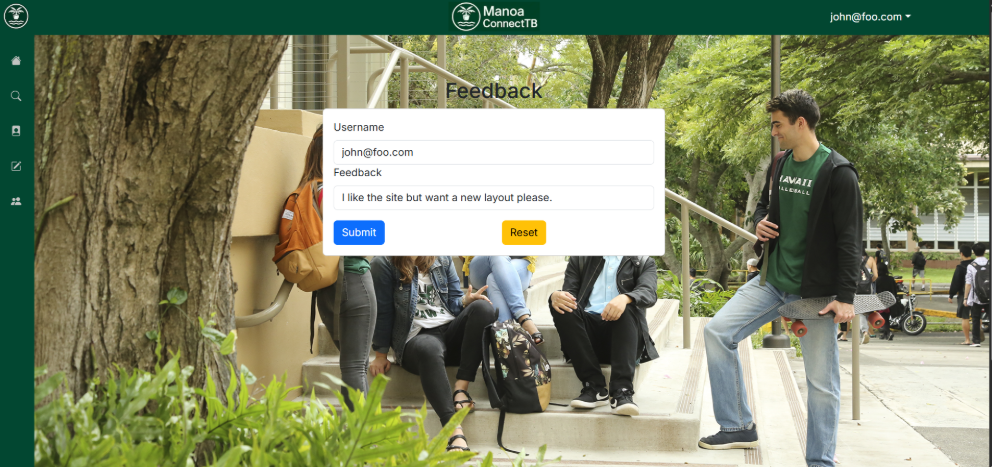
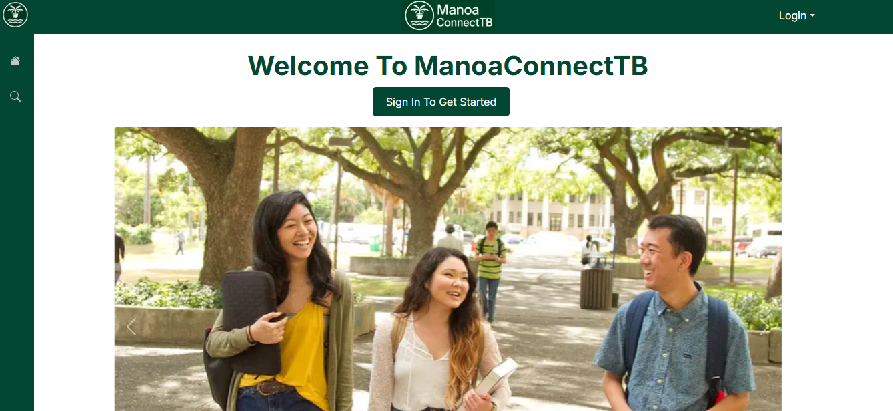
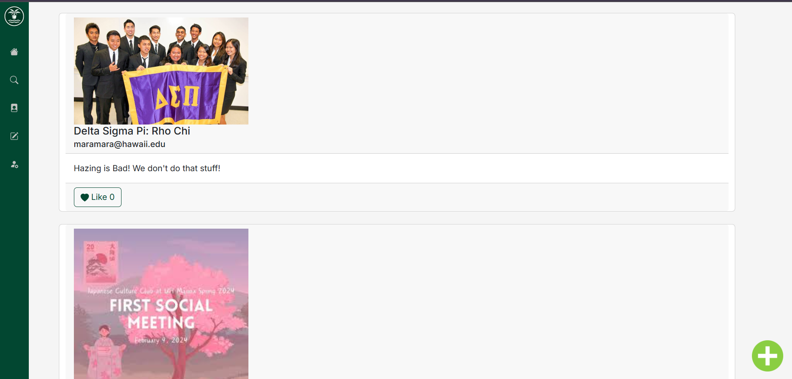

<div class="text-center p-4">
  
</div>
<div class="text-center p-4">
  
</div>
<div class="text-center p-4">
  
</div>
<div class="text-center p-4">
  
</div>
<div class="text-center p-4">
  
</div>
<div class="text-center p-4">
  
</div>


## My Contribution: Club Creation and Viewing

I implemented the **Create Club** feature, including the form modal and routing logic. This feature can be accessed via the **Explore Clubs** page. When a user clicks the image button in the top-right corner, a modal appears prompting them to enter:

- **Creator name**
- **Gmail**
- **Club name**
- **Description**
- **Image URL**

Here is the code used to render the modal form:

```
<Form onSubmit={handleSubmit(onSubmit)}>
  <Form.Group className="mb-2">
    <Form.Label>Creator Name</Form.Label>
    <Form.Control {...register('creator')} required />
  </Form.Group>
  ...
</Form>

```
Once the form is submitted, data is passed to this server function:
```
export async function makeClub(club: {
  name: string;
  description: string;
  creator: string;
  email: string;
  image: string;
}) {
  await prisma.club.create({ data: { ...club } });
}
```

##  Routing and Query Transfer

After a new club is created is displayed on the screen as a `ClubCard`. Each card includes the club's image, name, description, and creator info. Users who click on the card are taken to the **ClubProfilePage**, and important club data is passed along using **query parameters**.

### What are query parameters and why use them?

Query parameters are key-value pairs added to the end of a URL. Next.js allows us to **pass data between pages** without using a global state or database. This makes the website faster and more efficient for small data transfers, like showing club info on different pages.

For example, when a user clicks on a club card, we use the `Link` component from Next.js to go to `/clubs/profile` and include the club’s data as query parameters:

```
<Link
  href={{
    pathname: '/clubs/profile',
    query: {
      name: club.name,
      description: club.description,
      image: club.image,
      creator: club.creator,
      email: club.email,
    },
  }}
>
  <Card.Img src={club.image} />
</Link>
```
This creates a URL like:
```
/clubs/profile?name=Chess%20Club&description=Play%20chess&image=chess.png&creator=Alex&email=alex@gmail.com
```

### How do we read the query parameters?
On the ClubProfilePage, we use the useSearchParams() hook from Next.js to read the data:
```
const searchParams = useSearchParams();
const name = searchParams.get('name') || 'Unnamed Club';
const image = searchParams.get('image') || 'default.png';
```

This allows us to use the data passed from the card to display:
  - **The club name**
  - **The image**
  - **The description**
  - **The creator's name**
  - **The contact email**
All without needing to re-fetch it from the database.

### Navigating again with query
Inside the profile page, there is a View button and an image that users can click. When clicked, they take the user to the final /clubs page. We again use query parameters to keep passing the club's information:
```
const query = new URLSearchParams({
  name,
  image,
  creator,
  email
}).toString();

router.push(`/clubs?${query}`);
```
This keeps the user experience smooth and consistent, with no need to reload or re-enter information.


## What I Learned

During this project, I learned many useful skills while working on the Create Club and club viewing features. Here are some of the most important things I learned:

### Use Prisma to store and retrieve club data from PostgreSQL

I learned how to define a database model using Prisma, and how to insert new club data into a PostgreSQL database. Here’s the `Club` model I created in the `schema.prisma` file:

```
model Club {
  id          Int      @id @default(autoincrement())
  name        String
  description String
  creator     String
  email       String
  image       String
  createdAt   DateTime @default(now())
}
```
With this, I was able to use Prisma.club.create() and Prisma.club.findMany() to save and retrieve club info.

### Transfer data between pages using Next.js query parameters

I learned how to pass data from one page to another using a query in Next.js. Instead of storing everything globally or using a backend call, I passed values like club name and email in the URL. Then I used useSearchParams() to read them on the other page. This helped keep the user experience fast and simple.

### Pass props and manage component state in React

I got more comfortable using props to share data between React components, and using hooks like useState() to control UI changes. For example, I used useState to control when a modal is open or closed, and passed the club info into different components like ClubCard and EditClubModal.

### Control modals and asynchronous behavior using hooks

I used useTransition() and react-hook-form to handle form submissions smoothly. When a user creates a club, the modal closes and the page refreshes after the data is saved. I learned how to write async functions that update the database and the UI in the right order.

### Improve the layout and user experience with Bootstrap UI components

I used React Bootstrap to build clean and responsive components like forms, cards, buttons, and models. I also learned how to customize the styles using className and inline styles to make everything look more polished and user-friendly.

##  Conclusion
Working on the ManoaConnect project was a great experience for me. It helped me understand how modern web applications are built from both the frontend and backend sides. I got hands-on practice with building forms, managing user input, storing data in a database, and passing data between pages using query parameters. It also showed me how important small UI details are for creating a good user experience.

Most importantly, this project helped me grow my confidence in working with real-world tools like **React**, **Next.js**, **Prisma**, and **Bootstrap**. I feel much more prepared now to work on bigger and more complex projects in the future.
