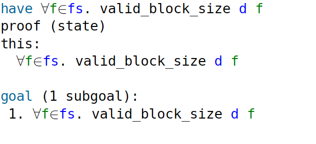

<div class="text-center p-4">
  
</div>

In this project, I verified the correctness of a file system written in OCaml by using Isabelle, a tool for formal proofs. OCaml is a functional programming language known for its strong type system, which helps build reliable software. The file system was designed to manage files using blocks, with operations for creating, deleting, and reading files. It also enforced strict rules, such as keeping file names within a certain size, ensuring data fits within blocks, and maintaining consistency in block size for all operations. My role was to prove that these rules were always followed and that the file system worked correctly under all conditions.

To verify this, I translated the file system's logic into mathematical models using Isabelle. I represented the storage device and files as records with properties like block size, file name constraints, and data length limits. For example, I defined rules to ensure no two files could have the same name and that file content always fit within the available blocks. I then proved important properties, such as the uniqueness of file names and the validity of file sizes, using Isabelle’s reasoning tools. I also verified helper functions, like the one that creates empty blocks, to ensure they worked correctly in all cases. These proofs showed that the file system followed its rules for every possible operation.

Here is some code that illustrates how I prove the correctness of the length of the filename in the filesystem:

```cpp
theorem valid_filename_length:
  assumes "f ∈ fs" "filesystem d fs"
  shows "length (filename f) ≤ block_size d - 9"
proof -
  from `filesystem d fs` have "valid_filename d (filename f)" using `f ∈ fs`
    by (simp add: filesystem_def)
  thus ?thesis
    by (simp add: valid_filename_def)
qed
```

You can learn more at the [UH Micromouse News Announcement](https://manoa.hawaii.edu/news/article.php?aId=2857).
